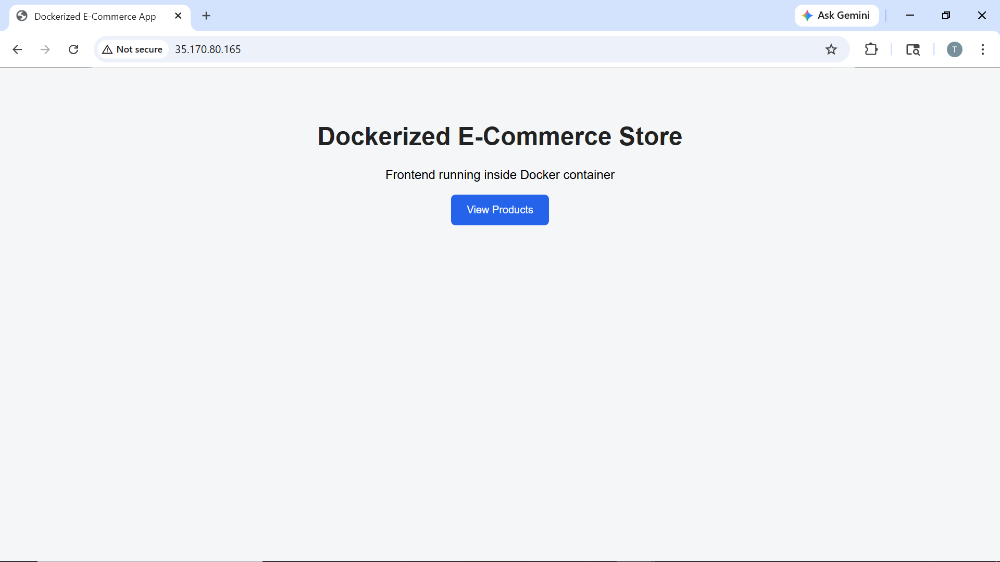
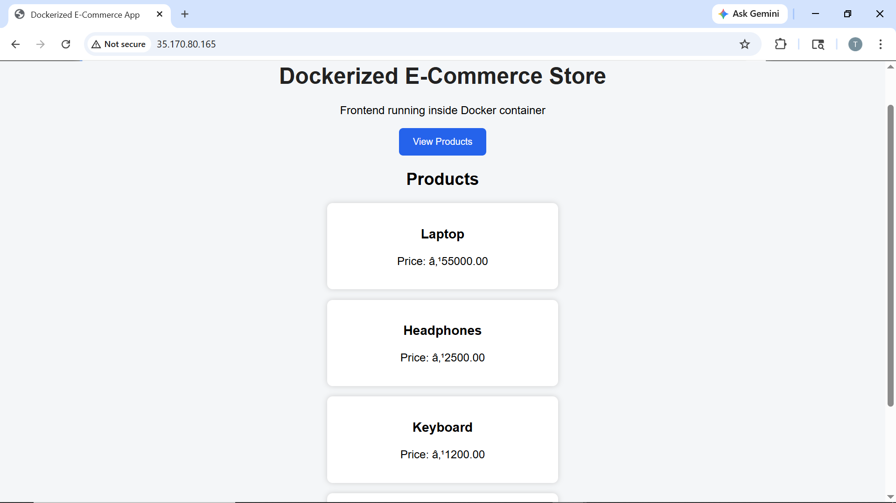
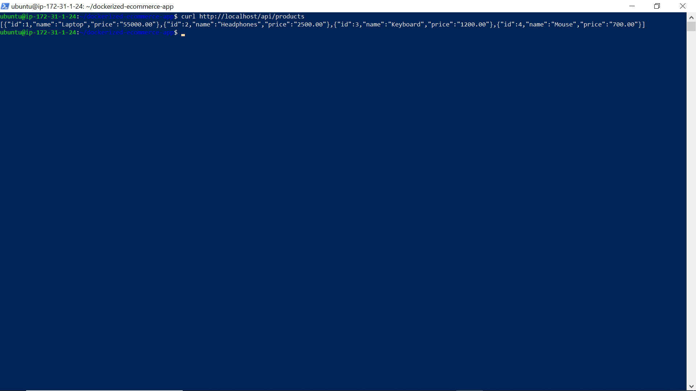
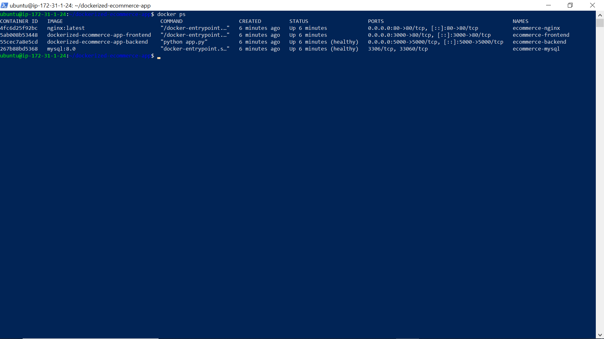
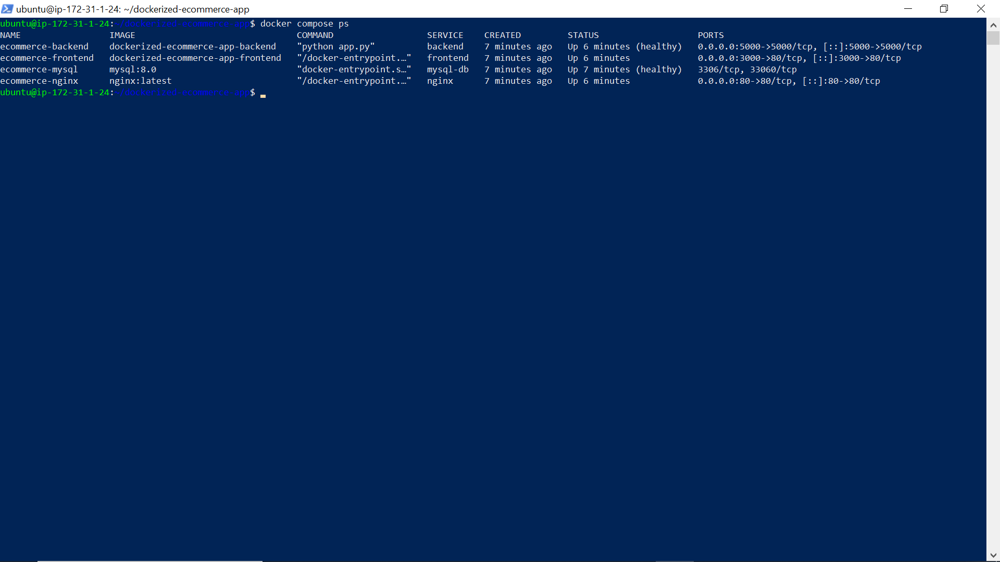
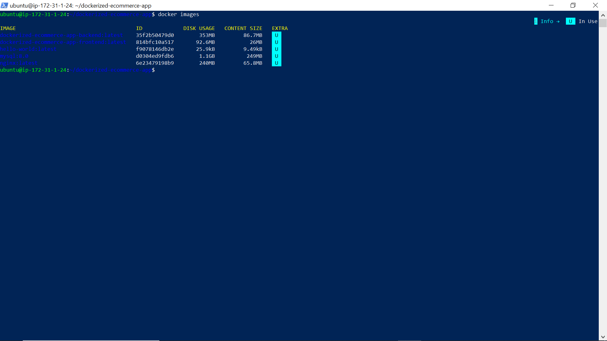
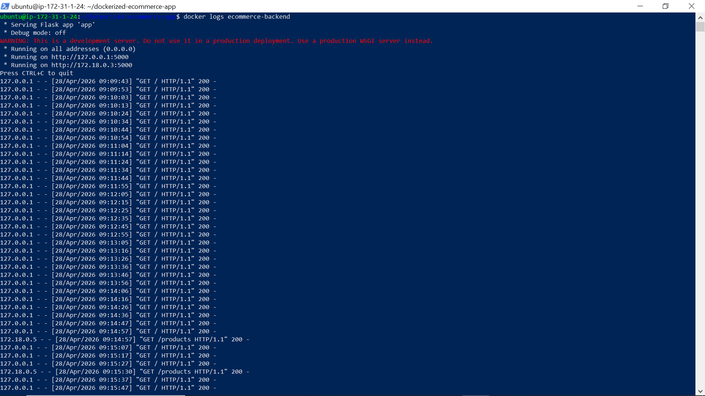
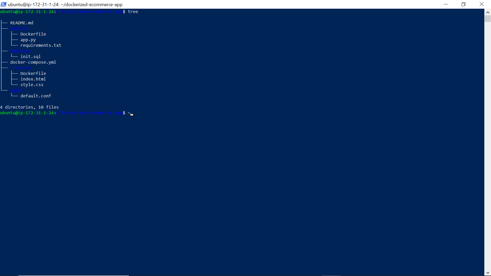
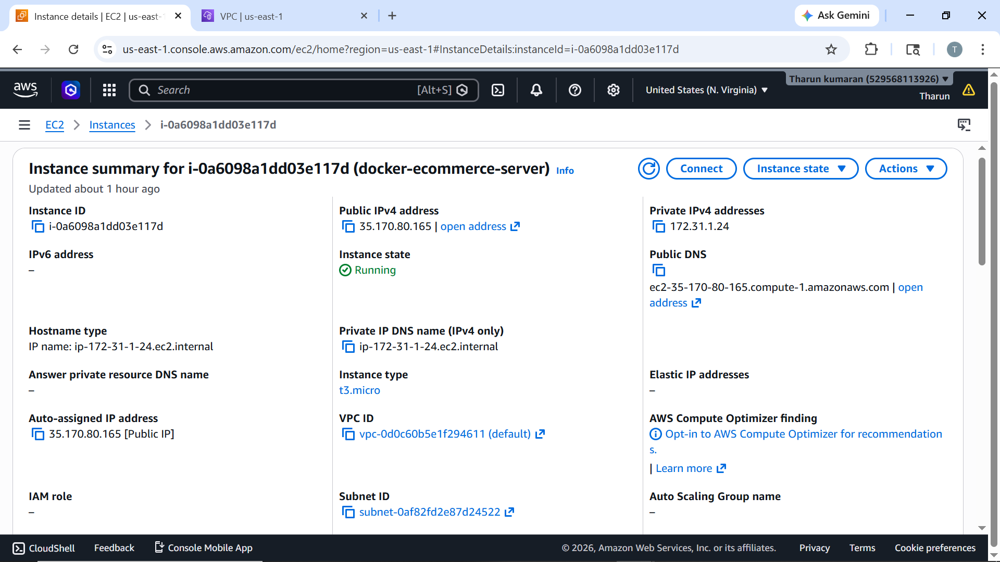
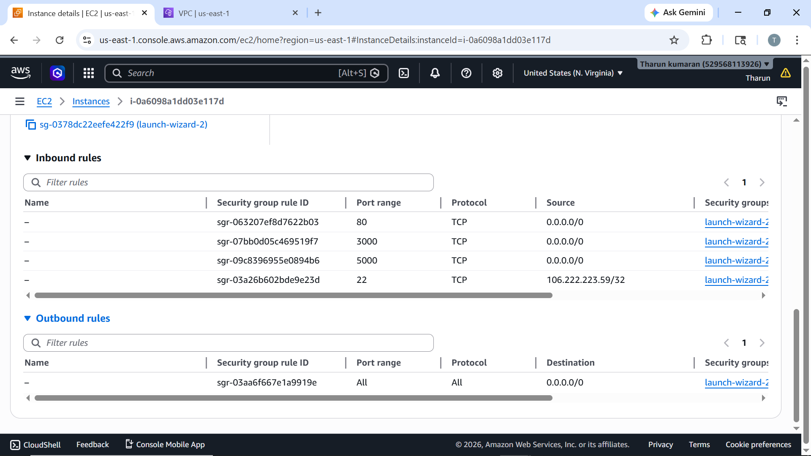

# dockerized-ecommerce-app
## Screenshots

### 1. Application Home Page

The application is accessed through the EC2 public IP using Nginx reverse proxy.

---

### 2. Products Loaded from Backend and MySQL

Frontend fetches product data from backend API, which retrieves data from MySQL container.

---

### 3. API Response through Nginx

The `/api/products` endpoint returns product data through the Nginx reverse proxy.

---

### 4. Running Docker Containers

Shows all running containers: Nginx, frontend, backend, and MySQL.

---

### 5. Docker Compose Service Status

Displays service health status and container orchestration.

---

### 6. Docker Images

Shows custom-built Docker images for frontend and backend.

---

### 7. Backend Logs

Displays backend logs and successful API requests.

---

### 8. Project Structure

Shows organized project structure with all components.

---

### 9. AWS EC2 Instance

Shows EC2 instance running the application.

---

### 10. Security Group Rules

Shows inbound rules allowing HTTP and SSH access.
